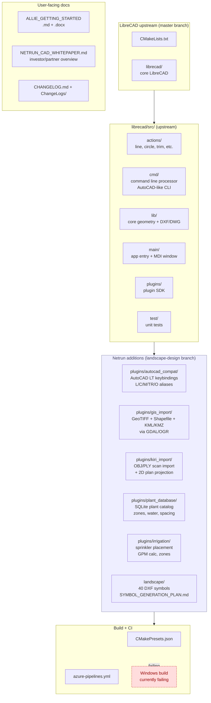
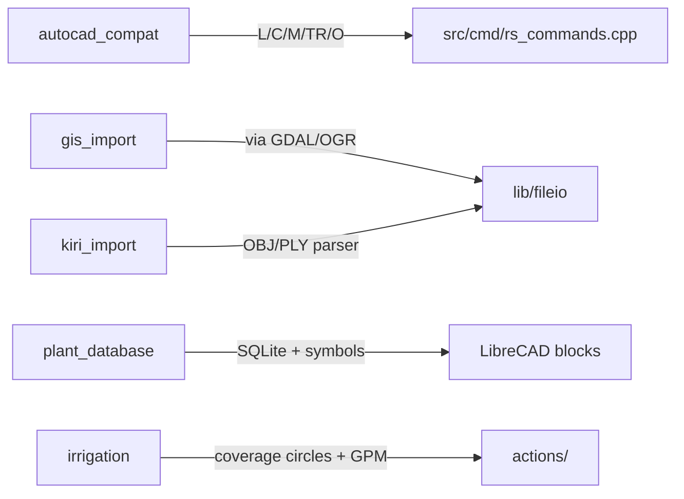
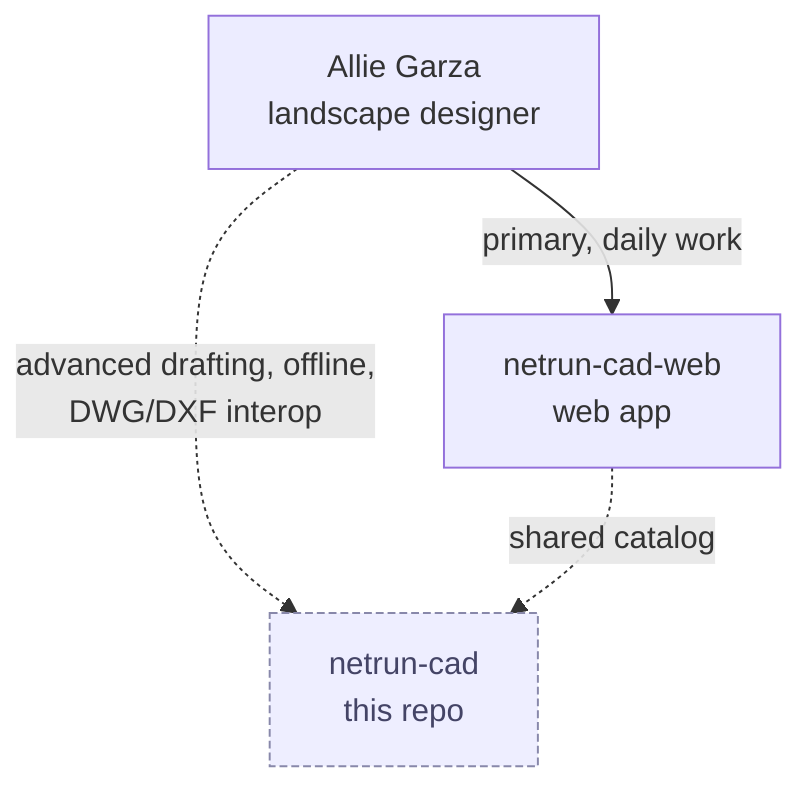

# Netrun CAD — Architecture

**Repository**: `netrun-cad` (Netrun Systems)
**Upstream**: [LibreCAD/LibreCAD](https://github.com/LibreCAD/LibreCAD) (GPLv2)
**Branch convention**: `landscape-design` (Netrun customizations), `master` (upstream sync)
**Target user**: Allie Garza — landscape designer returning to practice after AutoCAD LT 2014; works on macOS

**Role**: SECONDARY. The primary tool is `netrun-cad-web` (web-based CAD, separate repo). This desktop fork exists for offline / advanced 2D drafting workflows that the web app doesn't cover. The desktop build is currently broken on Windows (known gap per `CURRENT_STATE.md` — pipeline file present, build failing).

---

## 1. Repository structure



---

## 2. Plugin design principle

**All Netrun additions are isolated in `plugins/`** so upstream sync from LibreCAD remains low-friction. Per CLAUDE.md: "Keep all Netrun customizations in plugins/ or clearly marked sections to simplify upstream merging."

The 5 Netrun plugins are independent shared libraries loaded by LibreCAD's plugin system.



---

## 3. Build commands

```bash
# macOS (Allie's platform — works)
brew install cmake qt@6 boost freetype
mkdir build && cd build
cmake .. -DCMAKE_PREFIX_PATH=$(brew --prefix qt@6)
make -j$(nproc)
./desktop/LibreCAD

# Ubuntu/Debian
sudo apt install cmake qt6-base-dev libboost-all-dev libfreetype-dev
mkdir build && cd build && cmake .. && make -j$(nproc)
```

The Windows build (`azure-pipelines.yml`) is currently failing — known gap. macOS and Linux builds are functional.

---

## 4. Role vs netrun-cad-web



Per the `project_netrun_cad_allie.md` memory: netrun-cad / netrun-cad-web is an internal revenue SKU; Allie is Daniel's spouse + business partner, not a reference user; cad-web is the priority that needs to ship for paid landscape work. This desktop fork is the secondary path.

---

## 5. Key files

- `CMakeLists.txt` + `CMakePresets.json` — build configuration
- `librecad/src/cmd/rs_commands.cpp` — command aliases (AutoCAD mapping landing zone)
- `librecad/src/main/qc_applicationwindow.cpp` — main window + toolbars
- `librecad/src/lib/fileio/` — DXF/DWG I/O
- `plugins/{autocad_compat,gis_import,kiri_import,plant_database,irrigation}/` — Netrun plugins
- `landscape/` — DXF symbol library + generation plan
- `azure-pipelines.yml` — Windows CI (currently failing)
- `NETRUN_CAD_WHITEPAPER.md` — platform overview for investors / partners
- `ALLIE_GETTING_STARTED.md` — user onboarding

See `CLAUDE.md` for upstream sync guidance and full plugin descriptions.
